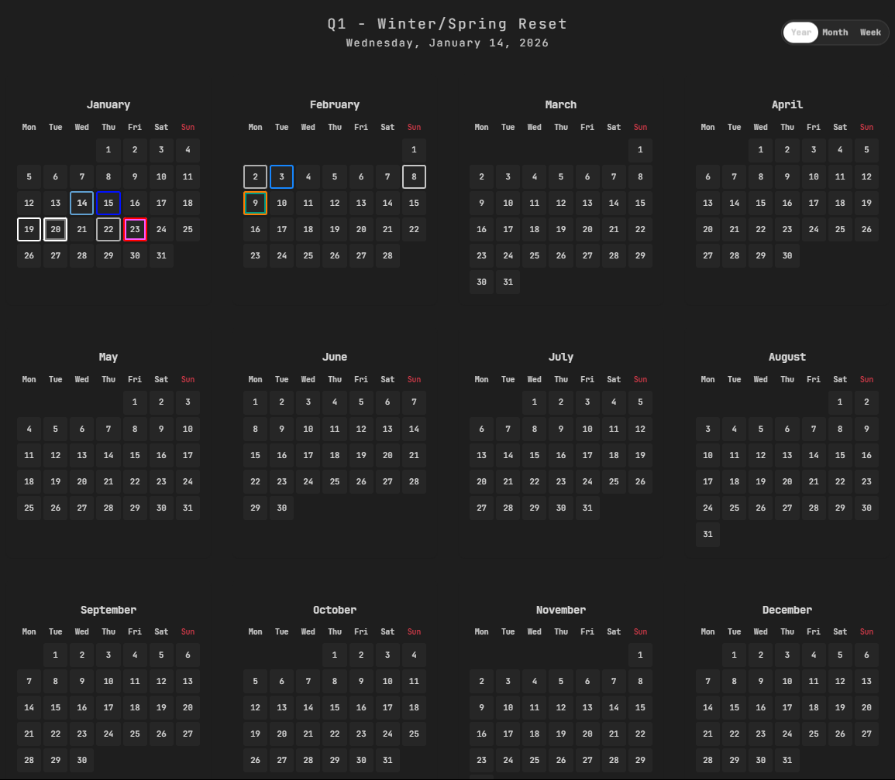
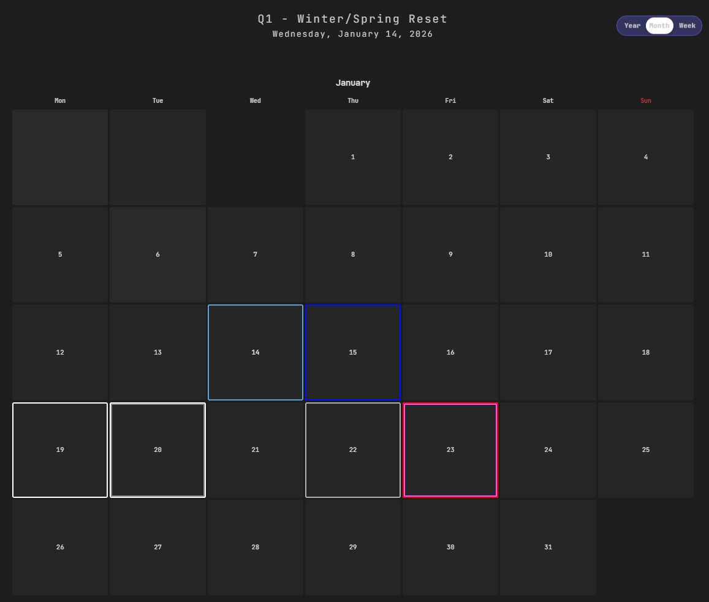
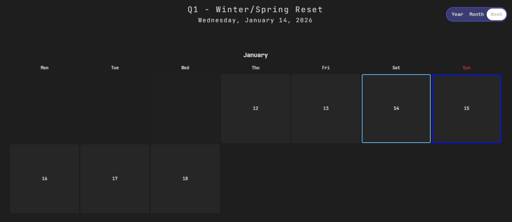
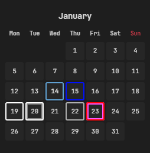
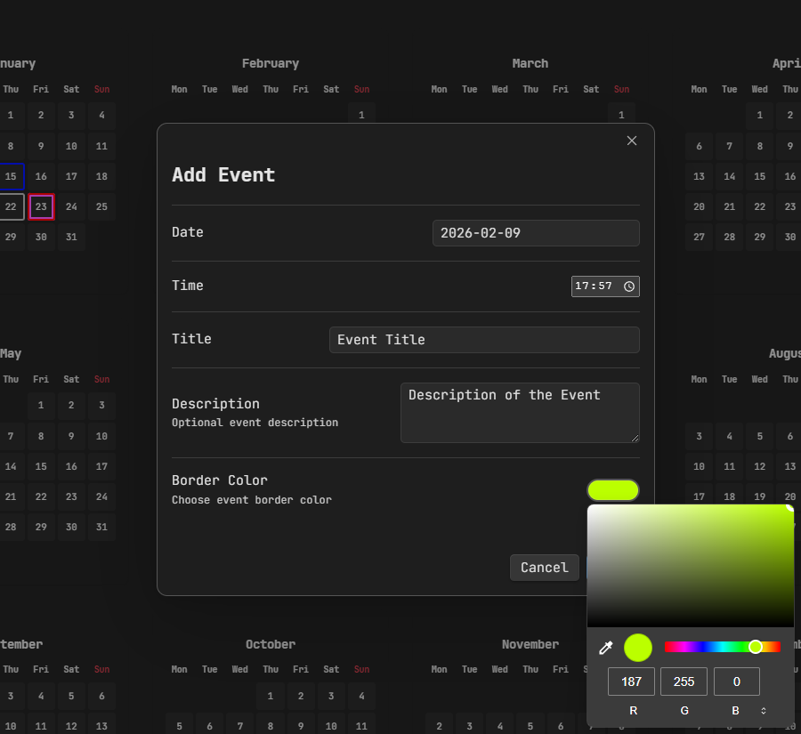
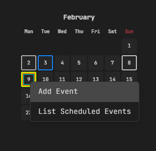
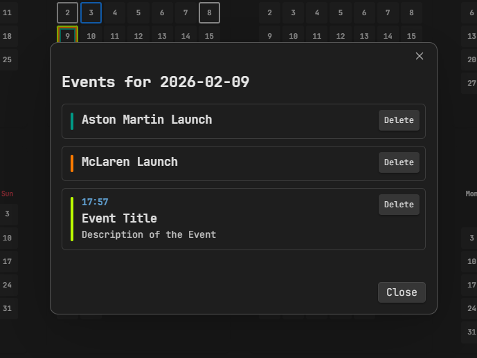

# Calendar Event Planner for Obsidian

A beautiful, feature-rich calendar plugin for Obsidian that helps you plan and visualize events with an elegant quarterly-themed interface.



## Features

### Multiple View Modes

- **Year View**: See all 12 months at a glance
- **Month View**: Focus on the current month
- **Week View**: Zoom into your current week




### Visual Event Management

- **Color-coded borders**: Each event gets a distinct colored border
- **Multiple events per day**: Stack unlimited events on any date with nested borders
- **Quarterly themes**: Beautiful seasonal themes that automatically change throughout the year



### Rich Event Details

- **Time tracking**: Optional time fields for scheduled events
- **Titles and descriptions**: Full text support for event details
- **Custom colors**: Choose any color for event borders
- **Easy editing**: Right-click any date to add or view events



### Intuitive Interface

- **Context menu**: Right-click any date to add events or view scheduled items.
- **Hover tooltips**: See all event details by hovering over dates.
- **Event list view**: Review all events for a specific day in an organized list.





### Data Management

- **JSON storage**: All events stored in a simple, portable JSON file
- **Auto-save**: Changes are automatically saved
- **Import/Export ready**: Easy data portability

## Installation

### From Obsidian Community Plugins (Recommended)

1. Open Obsidian Settings
2. Go to **Community Plugins** and disable Safe Mode
3. Click **Browse** and search for "Calendar Event Planner"
4. Click **Install** and then **Enable**

### Manual Installation

1. Download the entire repository.
2. Extract the files to your vault's `.obsidian/plugins/event-planner/` directory
3. Reload Obsidian
4. Enable the plugin in Settings → Community Plugins

### Build from Source

```bash
# Clone the repository
git clone https://github.com/Baldev8910/event-planner.git

# Navigate to the plugin directory
cd calendar-event-planner

# Install dependencies
npm install

# Build the plugin
npm run build
```

## Usage

### Opening the Calendar

- Click the **calendar icon** in the left ribbon, or
- Use the command palette (`Ctrl/Cmd + P`) and search for "Open Calendar"

### Adding Events

1. **Right-click** on any date in the calendar
2. Select **"Add Event"**
3. Fill in the event details:
   - Date (pre-filled)
   - Time (optional)
   - Title
   - Description (optional)
   - Border color
4. Click **Save**

### Viewing Events

- **Hover** over any date to see a tooltip with all events
- **Right-click** and select **"List Scheduled Events"** to see a detailed list

### Editing Events

1. Right-click on a date with events
2. Select **"List Scheduled Events"**
3. Click on any event to edit it
4. Make your changes and click **Save**

### Deleting Events

- **From the edit modal**: Click the **Delete** button
- **From the event list**: Click the **Delete** button next to any event

## Settings

Access plugin settings via Settings → Community Plugins → Calendar Event Planner

- **Event file path**: Choose where to store your events (default: `calendar-events.json`)

## Quarterly Themes

The calendar automatically adapts its theme based on the current quarter:

- **Q1 (Jan-Mar)**: Winter/Spring Reset 🌱
- **Q2 (Apr-Jun)**: Summer Surge ☀️
- **Q3 (Jul-Sep)**: Monsoon Momentum 🌧️
- **Q4 (Oct-Dec)**: Winter Lock-In ❄️

> These themes are not yet visual, just the headers.

## Data Structure

Events are stored in JSON format at the path specified in settings. Example:

```json
{
  "2026-01-15": [
    {
      "time": "14:00",
      "title": "Team Meeting",
      "desc": "Quarterly review",
      "color": "#1CA08F"
    },
    {
      "time": "18:30",
      "title": "Dinner",
      "desc": "Birthday celebration",
      "color": "#FF6B6B"
    }
  ]
}
```

## Contributing

Contributions are welcome! Please feel free to submit a Pull Request.

### Development Setup

```bash
# Clone and install
git clone https://github.com/Baldev8910/event-planner.git
cd calendar-event-planner
npm install

# Development build (with auto-rebuild)
npm run dev

# Production build
npm run build
```

### Guidelines

- Follow the existing code style
- Test your changes thoroughly
- Update documentation as needed
- Add comments for complex logic

## Bug Reports & Feature Requests

Found a bug or have a feature idea? Please open an issue on [GitHub Issues](https://github.com/Baldev8910/event-planner/issues).

When reporting bugs, please include:

- Obsidian version
- Plugin version
- Steps to reproduce
- Expected vs actual behavior
- Screenshots if applicable

## Acknowledgments

- Built with ❤️ for the Obsidian community
- Inspired by the need for better calendar integration in Obsidian
- Thanks to all contributors and users!

## Contact

- **GitHub**: [@Baldev8910](https://github.com/Baldev8910)
- **Issues**: [GitHub Issues](https://github.com/Baldev8910/event-planner/issues)

---

⭐ If you find this plugin useful, please consider giving it a star!

## Roadmap

- [ ] Recurring events
- [ ] Event categories/tags
- [ ] Export to ICS format
- [ ] Integration with Obsidian Daily Notes
- [ ] Custom theme colors
- [ ] Event reminders
- [ ] Search/filter events

---
